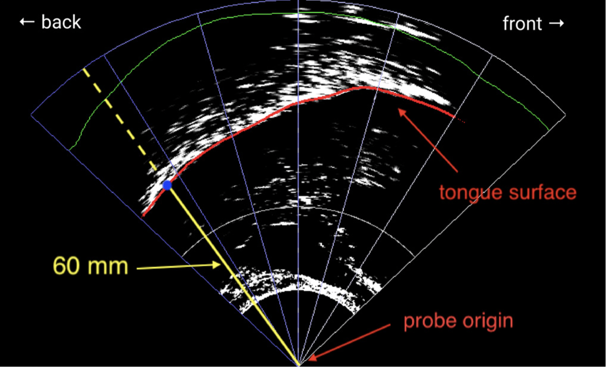
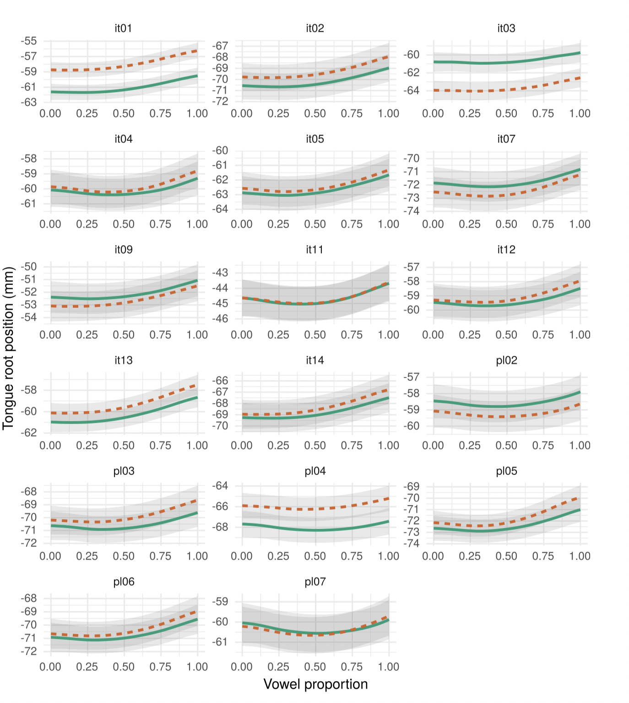
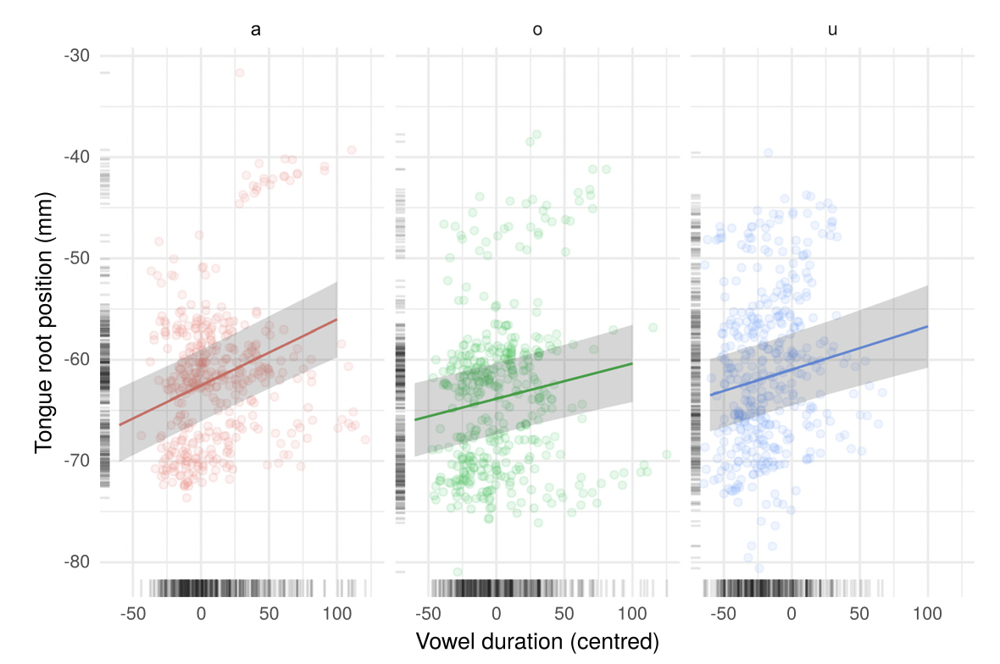
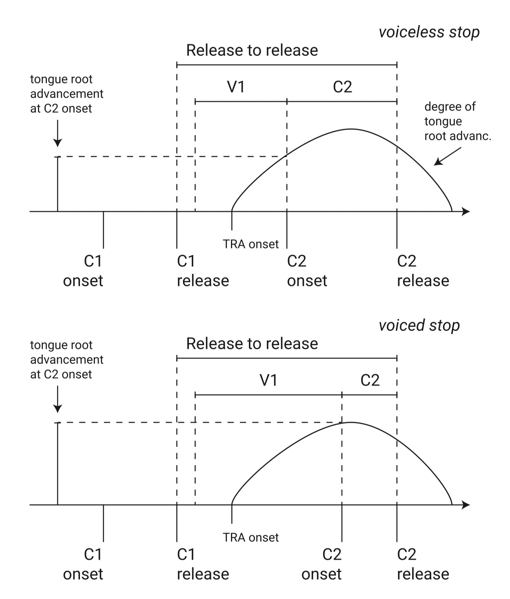
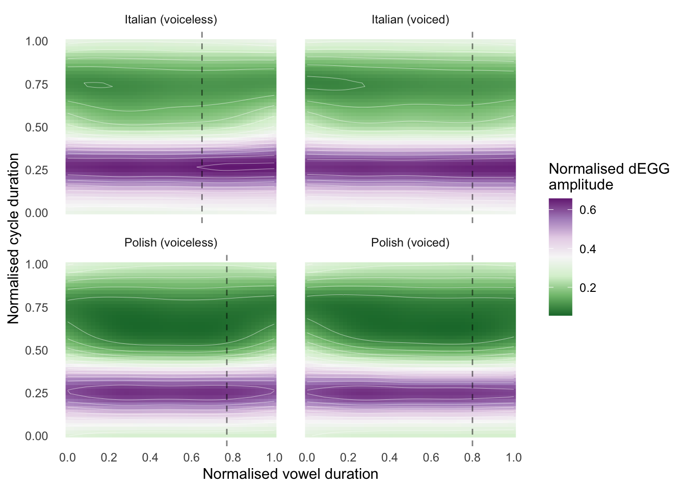

```{r setup, include=FALSE}
options(htmltools.dir.version = FALSE)
```

---

# Lasciate ogne speranza, voi ch'intrate

Leave out every *expectation*, ye who enter here.

---

# Weep not, my children

> Weep not, my children, for today's syntax is tomorrow's morphology.

.right[—Givón's slogan]

> Today's lexical phonology is yesterday's postlexical phonology and the day before yesterday's phonetics.

.right[—Bermúdez-Otero]

> Today's allophonic variation can lead to tomorrow's sound change.

.right[—Ohala]

---

class: right middle inverse

# Today's variability is tomorrow's<br>sound change

---

class: right middle inverse

# Today's variability is tomorrow's<br>sound change, which is the day after tomorrow's variability

---

# Chicken or the egg? Variability or change?

Infinite regress

Feedback loops

---

# Today's snapshot

* Articulatory description of variability (coarticulation).

* Snapshot of a particular point in time.

* Based on today's variability

  * How did the current situation came to be?

  * How might it develop?

---

# Dynamic systems

---

# Some housekeeping

* Agnostic about neuro-cognitive organisation of Human Language, in particular as far as the sound/sign system is concerned.

* "Phonetology" to refer to the study of the sound/sign system (i.e. the phonetological system).

  * Includes production, transmission, perception, cognitive and neuro-physiological processes/representations.

* Agnostic about which parts of the system are *both* innate *and* specific to Language.

* Agnostic about the neuro-cognitive units of the phonetological system (phoneme, features, elements, moras, gestures, ...).

* Preference for a gradient conceptualisation of gradient vs categorical (i.e. it is a scale from most gradient to most categorical).

* Preference for a gradient conceptualisation of contrastive vs non-contrastive. (cf with idea of quasi-phoneme).

---

# tl;dr

The main takeaways are:

- Variability and change are one and the same:
  - Variability is the state.
  - Change is the process.

- Synchronic variability in production can illuminate our understanding of sound change.

- It does so by casting spotlights over the multidimensional space of possible sound changes.

---

# Case studies

* Vowel duration.

* Vowel nasalisation.

* Rhinoglottophilia.

---

class: center middle inverse

# VOWEL DURATION

---

# Vowel duration

* Lexical contrast ("vowel length"): Skr *mana* 'spikenard' vs *māna* 'opinion'.

--

* Vowel quality ("intrinsic vowel duration"): higher vowels tend to be shorter than lower vowels.

--

* Contextual variability ("extrinsic vowel duration"):

  * Prosody (stress, accent, syllabic structure, ...).
  * Consonant manner of articulation.
  * Consonant place of articulation.
  * Consonant phonation.

---

# Vowel duration and consonant phonation

* Vowels tend to be shorter when followed by "voiceless" consonants and longer when followed by "voiced" consonants.

* Vowels tend to shorter when followed by unaspirated consonants and longer when followed by aspirated consonants.

* Vowels followed by ejective consonants have a duration that is between that of voiceless and that of voiced consonants.

---

# Interim housekeeping

* Many two-way phonation contrasts are described as "voicing".

  * True-voicing vs aspirating languages is not enough.

* Voicing as a comparative concept.

---

# Little did we know

We know very little about the inner workings of speech production and articulation (motor control).

* Exploratory study of articulatory aspects of VC sequences in Italian and Polish.

* Ultrasound Tongue Imaging.

* Electroglottography.

---

# Articulatory correlates of voicing

* Aerodynamic Voicing Constraint.

* Tongue Root Advancement to overcome increased intra-oral pressure.

---

# Italian and Polish: articulatory data

* Ultrasound Tongue Imaging (<https://doi.org/10.1121/10.0000556>)

* Electroglottography

---

# Italian and Polish: Tongue root advancement



---

# Italian and Polish: Tongue root advancement

.center[]

---

# Italian and Polish: Tongue root advancement

.center[]

---

# Italian and Polish: Tongue root advancement

.center[]

---

# Italian and Polish: Glottal abduction

.center[]


---


class: center middle inverse

# VOWEL NASALISATION

---

class: center middle inverse

# RHINOGLOTTOPHILIA
