```{r setup, include=FALSE}
knitr::opts_chunk$set(echo = FALSE, message = FALSE)
knitr::opts_knit$set(root.dir = here::here())
options(htmltools.dir.version = FALSE)
```

```{r xaringanExtra, echo=FALSE}
xaringanExtra::use_xaringan_extra(c("panelset", "tachyons"))
```

background-image: url(img/hell_gate.jpg)
background-size: cover

# .right.white[*Lasciate ogne speranza, voi ch'intrate*]

<br>
<br>
<br>
<br>
<br>
<br>

.white[**Leave out every *expectation*,<br>ye who enter here.**]

---

class: center middle inverse

# CONCEPTUAL BACKGROUND

---

# Weep not, my children

<br>
<br>

> Weep not, my children, for today's syntax is tomorrow's morphology.

.right[—Givón's slogan]

--

> Today's lexical phonology is yesterday's postlexical phonology and the day before yesterday's phonetics.

.right[—Bermúdez-Otero]

--

> Today's allophonic variation can lead to tomorrow's sound change.

.right[—Ohala]

---

class: right middle inverse

# Today's variability is tomorrow's<br>sound change

---

class: right middle inverse

# Today's variability is tomorrow's<br>sound change, which is the day after tomorrow's variability

---

background-image: url(img/ray-infinite.png)
background-size: cover

# .white[Chicken or the egg? Variability or change?]

???

* Infinite regress: ... < A < B

---

background-image: url(img/dynamic-systems.png)
background-size: contain

# .center[Dynamic systems]

---

# Dynamic systems

<br>
<br>

* Connected and interacting elements in constant flux.

* A **state** is described by a set of variables whose values change as a function of time.

* Set of all possible values is the **phase space**.

* **Attractors** and **basins of attraction**.

* **Change = process** (bifurcation point, catastrophe, phase shift).

* **Self-organising** system.

---

class: center middle inverse

# If you look at the system in flux, you see a .green[process].

# If you look at the system at a particular point, you see a .green[state].

???

Particle or wave? Both!

---

# Today's snapshot of the flux

<br>
<br>

* **Snapshot** of a particular point in time (today) to capture a state from the process flux.

* **Articulatory** description of variability (including coarticulation).

* Based on today's variability

  * How did the current situation came to be?

  * How might it develop?

---

# tl;dr

The main takeaways are:

- **Variability and change are one and the same.**
  - Variability is the state.
  - Change is the process.

- **Synchronic variability in production can illuminate our understanding of sound change.**

- It does so by pointing us to areas within the phase space.

---

# Case studies

<br>
<br>

* **Vowel duration.**

  * Italian, Polish, Manchester English.

* **Vowel nasalisation.**

  * German, British English, American English.

* **Rhinoglottophilia.**

  * Nasality and glottal spread.

---

# Some housekeeping

* Agnostic about neuro-cognitive organisation of Human Language, in particular as far as the sound/sign system is concerned.

* "Phonetology" to refer to the study of the sound/sign system (i.e. the phonetological system).

  * Includes production, transmission, perception, cognitive and neuro-physiological processes/representations.

* Agnostic about which parts of the system are *both* innate *and* specific to Language.

* Agnostic about the neuro-cognitive units of the phonetological system (phoneme, features, elements, moras, gestures, ...).

* Preference for a gradient conceptualisation of gradient vs categorical (i.e. it is a scale from most gradient to most categorical).

* Preference for a gradient conceptualisation of contrastive vs non-contrastive. (cf with idea of quasi-phoneme).

---

class: center middle inverse

# VOWEL DURATION

---

# Vowel duration

* **Lexical contrast** ("vowel length")

  * Skr *mana* 'spikenard' vs *māna* 'opinion'.

--

* **Vowel quality** ("intrinsic vowel duration"): higher vowels tend to be shorter than lower vowels.

--

* **Contextual variability** ("extrinsic vowel duration"):

  * Prosody (stress, accent, syllabic structure, ...).
  * Consonant manner of articulation.
  * Consonant place of articulation.
  * Consonant phonation.

---

# Vowel duration and consonant phonation

<br>
<br>

* Vowels tend to be shorter when followed by "voiceless" consonants and longer when followed by "voiced" consonants.

--

* Vowels tend to shorter when followed by unaspirated consonants and longer when followed by aspirated consonants.

--

* Vowels followed by ejective consonants have a duration that is between that of voiceless and that of voiced consonants.

---

# Interim housekeeping

<br>
<br>

* Many **two-way phonation contrasts** are described as "voicing".

  * True-voicing vs aspirating languages is not enough.

* Voicing as a **comparative concept.**

---

# Little did we know

<br>
<br>

* We know very little about the inner workings of speech production and articulation (motor control).

* Exploratory study of **articulatory aspects of VC sequences** in Italian, Polish and English.

  * Ultrasound Tongue Imaging (Italian and Polish).

  * Electroglottography (Italian and Polish).

  * Acoustics (all).

---

# Articulatory correlates of voicing

* Aerodynamic Voicing Constraint.

  * **Tongue Root Advancement** to overcome increased intra-oral pressure.

* **Glottal spread** for absence of voicing (voicelessness).

* **Word-level gestural phasing**.

---

# Italian and Polish: Tongue root advancement


---

# Italian and Polish: Tongue root advancement

.center[]

---

# Italian and Polish: Tongue root advancement

.center[]

---

# Italian and Polish: Tongue root advancement

.center[]

---

# Italian and Polish: Glottal abduction

.center[]

---

# Temporal stability

.center[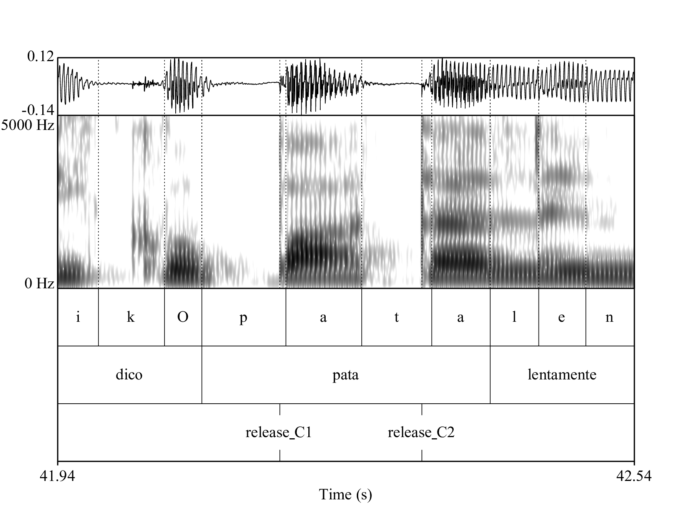]

---

# Temporal stability

.center[]

---

# Temporal stability

.center[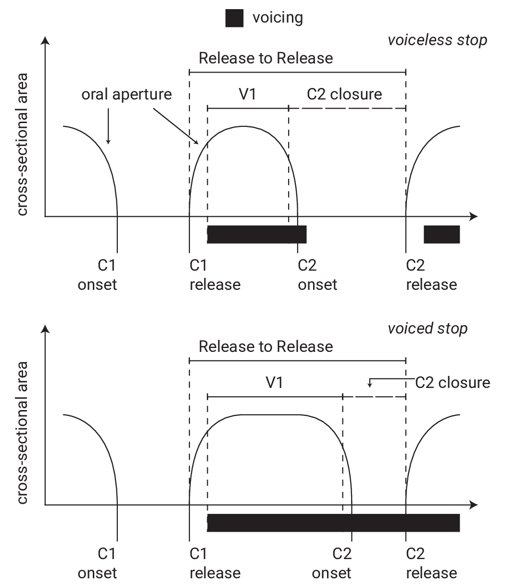]

---

# Bringing it together

.center[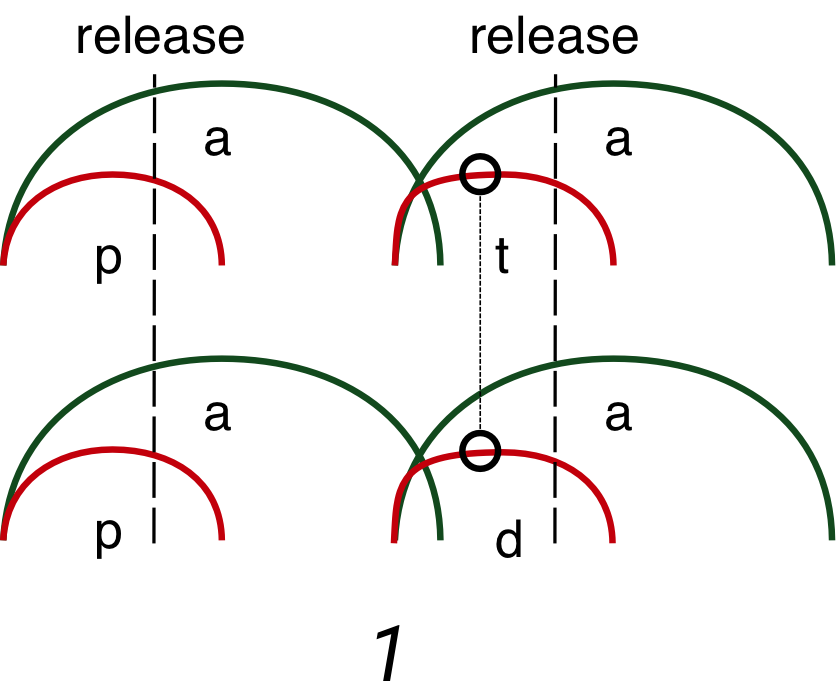]

---

# Bringing it together

.center[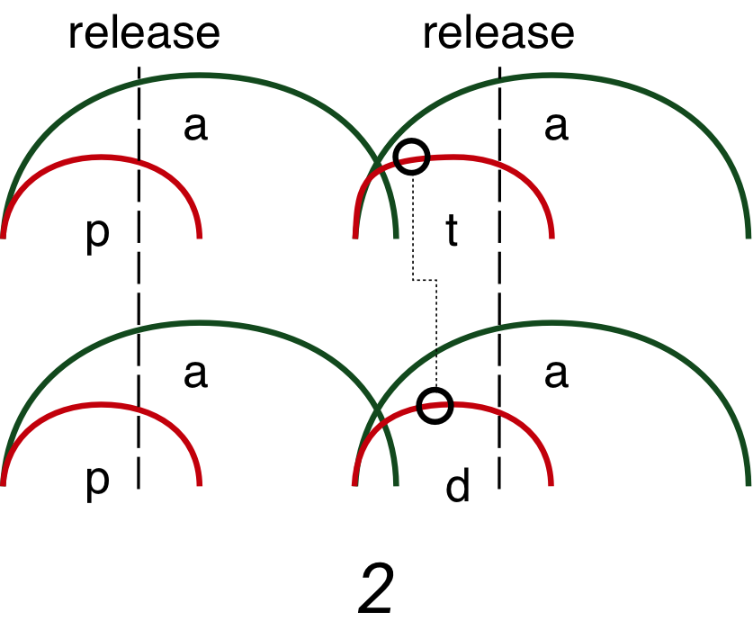]

---

# Bringing it together

.center[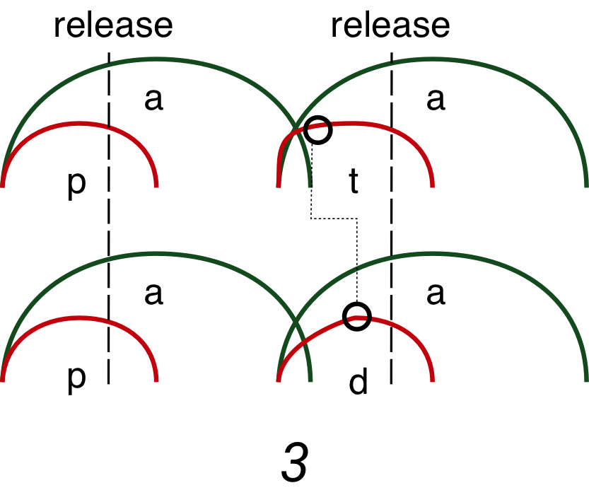]

---

# Bringing it together

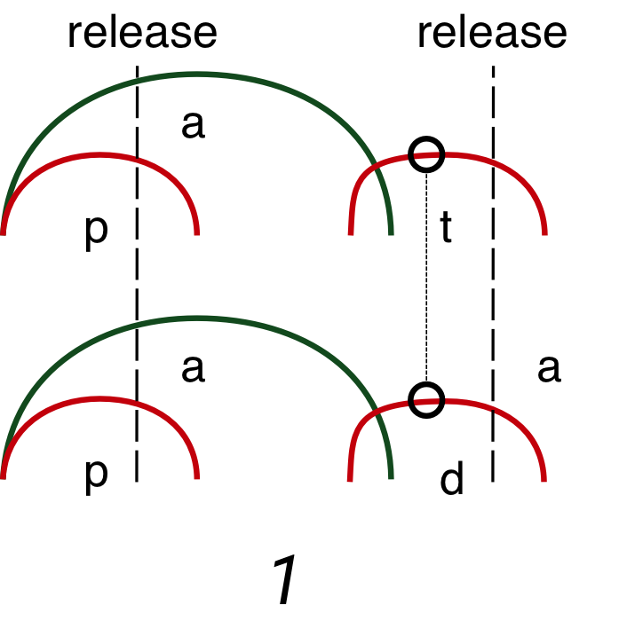

---

# Bringing it together

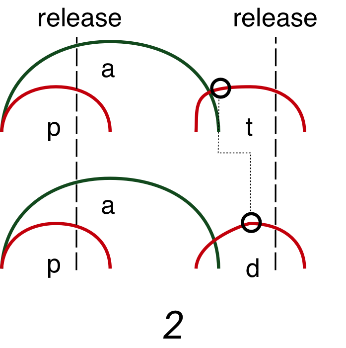

---

# Bringing it together

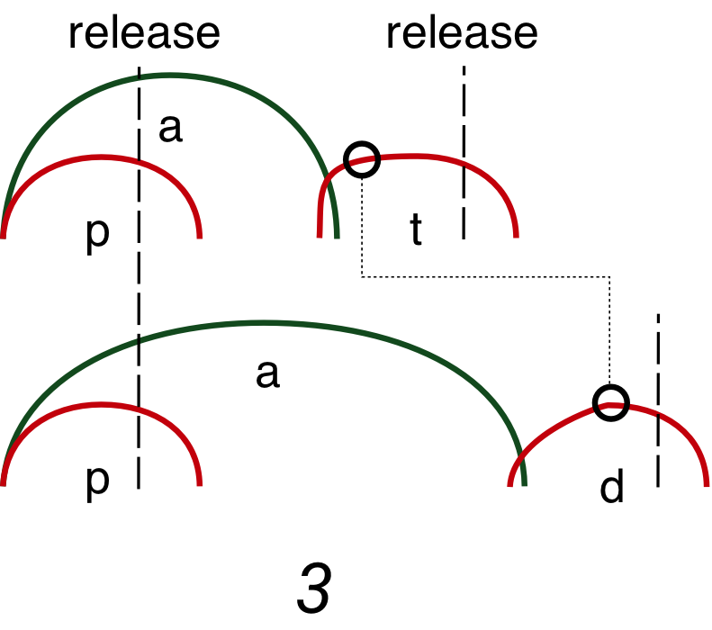

---

# Bringing it together

<br>

.center[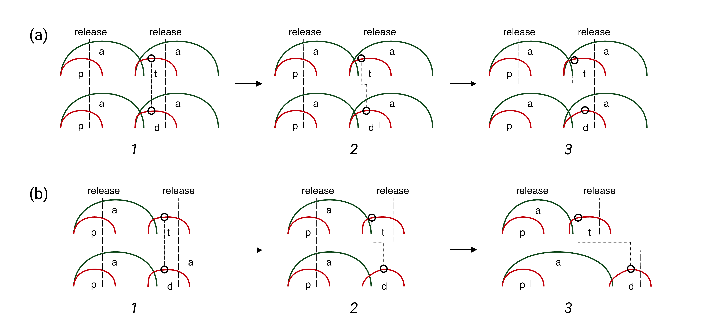]

---

class: center middle inverse

# VOWEL NASALISATION

---

# Phon(et)ological systems

.center[
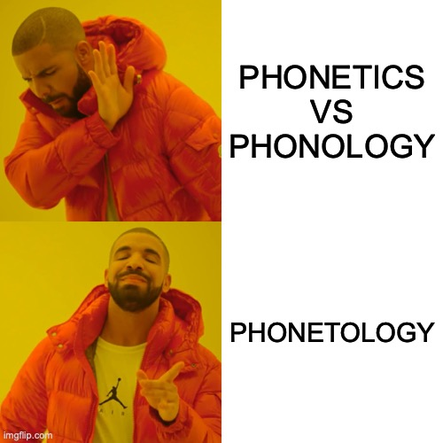
]

---

# Phonologisation

.panelset[
.panel[.panel-name[Structuralism]
.bg-washed-green.b--dark-green.ba.bw2.br3.shadow-5.ph4.mt5[

Phonologisation is the creation of a new phonemic contrast, or in other words when a contextual allophone becomes *contrastive* (i.e. a phoneme).

]

.tr[
— Kiparsky 2015
]

]

.panel[.panel-name[Lexical Ph]
.bg-washed-blue.b--dark-blue.ba.bw2.br3.shadow-5.ph4.mt5[

A process is phonologised when it goes from being post-lexical to being lexical.

]

.tr[
— Kiparsky 1988
]

]

.panel[.panel-name[Stratal OT]


.bg-washed-yellow.b--gold.ba.bw2.br3.shadow-5.ph4.mt5[

Phonologisation occurs when the constraint ordering of the phrasal domain is carried over to the word and stem domains.

]

.tr[
— Kiparsky 2000, Bermúdez-Otero 2017
]

]

.panel[.panel-name[Life Cycle]

.bg-near-white.b--purple.ba.bw2.br3.shadow-5.ph4.mt5[

Phonologisation occurs when a physio-anatomical ("mechanic") phenomenon comes under the control of the speaker/hearer and becomes part of their grammar (more specifically, part of the *phonetic module* of the grammar).

]

.tr[
— Bermúdez-Otero 2007, Bermúdez-Otero 2015
]

]

.panel[.panel-name[Exemplar]

.bg-washed-yellow.b--orange.ba.bw2.br3.shadow-5.ph4.mt5[

Every type of sound variation/alternation is "phonologised" (i.e. neuro-cognitive permanence) as soon as it is experienced by the speaker/hearer *and* stored in memory.

]

.tr[
— Johnson 1997, Sóskuthy et al. 2018, Ambridge 2018, Todd et al. 2019
]

]

]

---

class: middle center

<span style="font-size:5rem;">Ṽ.green[N] > Ṽ.light-green[N] > Ṽ.light-gray[N] >  .green[Ṽ]</span>


---

class: center middle

# What does the<br>.dark-green[reduction of nasals]<br>look like?

---

class: inverse center middle bg-black

# .dark-green[nasal]<br>=<br>oral constriction<br>+<br>velum opening

---

class: inverse center middle bg-black

# .dark-green[nasal]<br>=<br>tongue tip constriction<br>+<br>velum opening

---

# Real-time MRI

<br>

.cf.ph2-ns[

.fl.w-40.pa2[
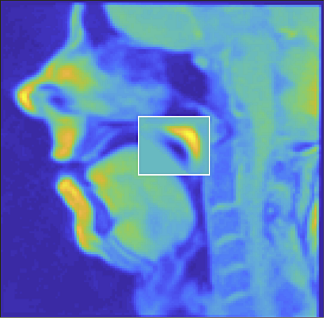
]

.fl.w-60.pa2[
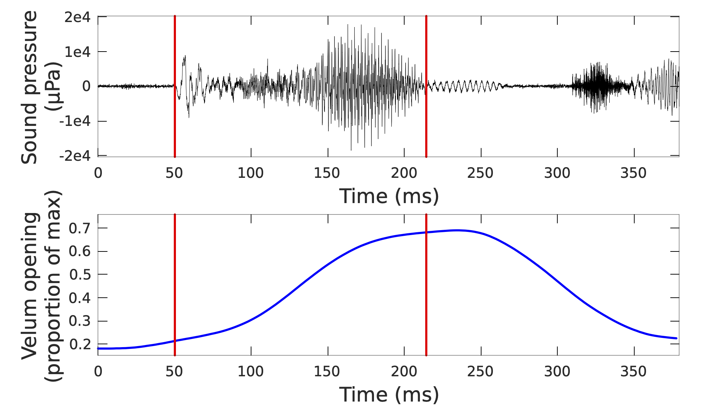
]

]

---

# Tongue tip and velum

<br>

.center[
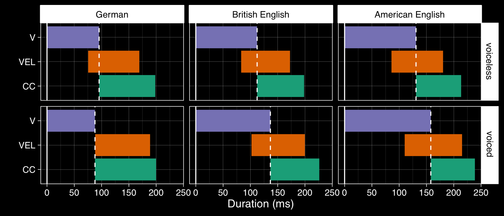
]

---

# Tongue tip and velum

.center[
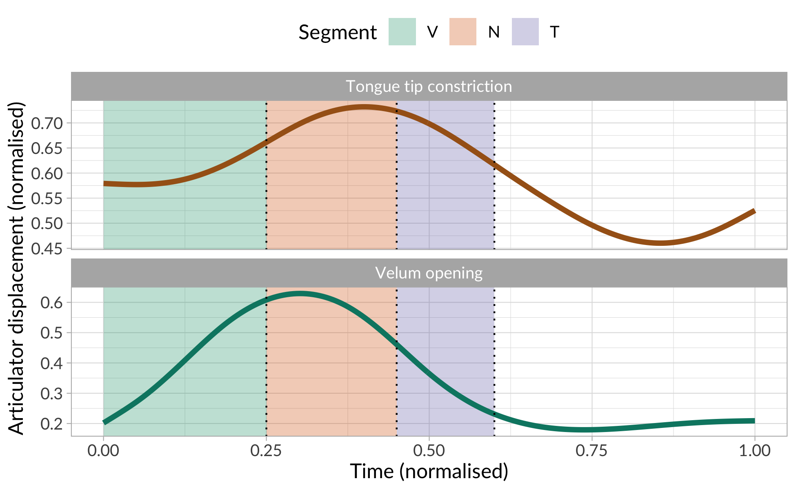
]


---

# Tongue tip and velum

<br>

.center[
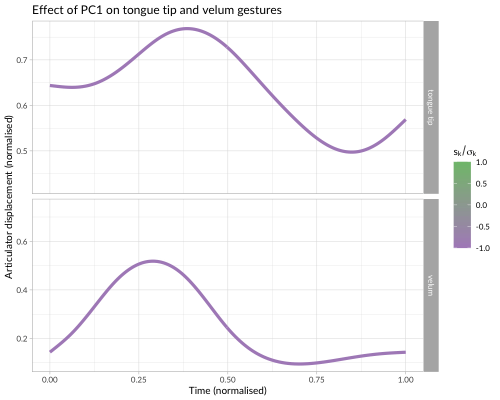
]

---

# Tongue tip and velum

.center[
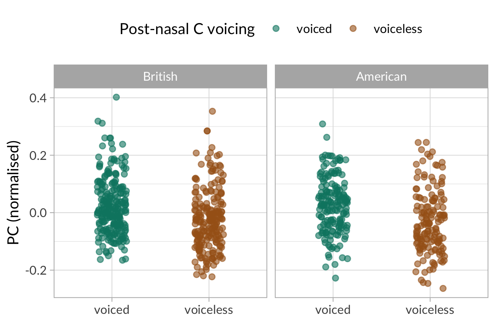
]

---

class: center middle inverse

# RHINOGLOTTOPHILIA
