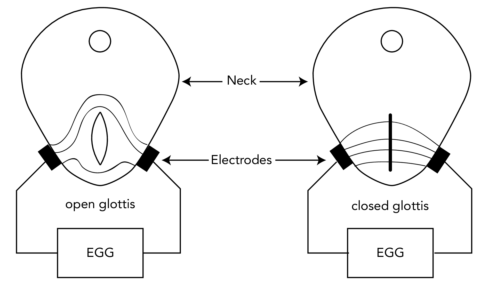
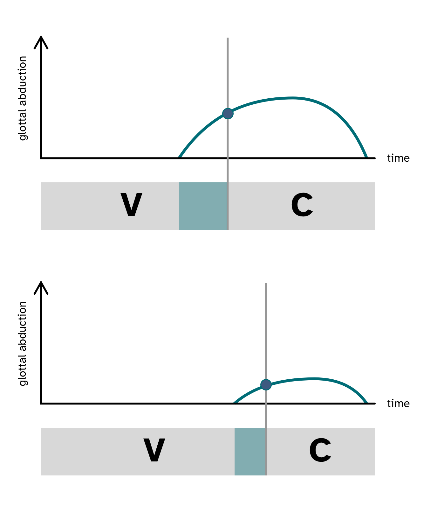

```{r setup, include=FALSE}
knitr::opts_chunk$set(echo = FALSE, message = FALSE)
knitr::opts_knit$set(root.dir = here::here())
options(htmltools.dir.version = FALSE)
xaringanExtra::use_xaringan_extra(c("panelset", "tachyons"))
```

class: center middle inverse

# Background

---

# Coarticulation and sound change

.bg-washed-green.b--dark-green.ba.bw2.br3.shadow-5.ph4.mt5[
**Coarticulation** is a known factor in the development of sound change.
]

--

.bg-washed-yellow.b--yellow.ba.bw2.br3.shadow-5.ph4.mt5[
Speech is a complex system of **finely coordinated movements that unfold in time**.
]

--

.bg-washed-blue.b--dark-blue.ba.bw2.br3.shadow-5.ph4.mt5[
What can **dynamic articulatory data** tells us about sound change?
]

---

# Two case studies

.bg-washed-blue.b--dark-blue.ba.bw2.br3.shadow-5.ph4.mt5[
**Case study 1**

* Tongue root position and timing of oral closure in VC sequences.
* Ultrasound tongue imaging of Italian and Polish.
]

.bg-washed-blue.b--dark-blue.ba.bw2.br3.shadow-5.ph4.mt5[
**Case Study 2**

* Glottal spread and timing of oral closure in VC sequences.
* Electroglottography of Italian and Polish.
]


---

class: center middle inverse

# Case study 1

## Italian and Polish: Voicing and tongue root advancement

---

background-image: url(img/vibration-closure.png)
background-size: contain

---

background-image: url(img/closure-duration.png)
background-size: contain

# Closure duration

---

background-image: url(img/tongue-root-1.png)
background-size: contain

# Tongue root<br>position

---

background-image: url(img/tongue-root-2.png)
background-size: contain

# Tongue root<br>position

---

background-image: url(img/tongue-root-3.png)
background-size: contain

# Tongue root<br>position

---

# Ultrasound tongue imaging (UTI)


---

# Tongue root movement within the vowel

.center[]

---

# Tongue root position and vowel duration

.center[]

---

# From synchrony to diachrony

.pull-left[

]

--

.pull-right[

]

---

# Afterthoughts

- Findings are in line with previous work on tongue root .f6[(Kent & Moll 1969; Perkell 1969; Westbury 1983; Ahn 2018; Vazquez-Alvarez & Hewlett 2007)].

--

  - Tongue root movement onset during the articulation of the vowel.
  - Advancement both when following stop is voiced *and* voiceless.

--

- Later closure onset has double advantage:

--

  1. A greater degree of tongue root advancement is achieved at vowel offset/closure onset.
  2. The stop closure is shorter.

--

- Double advantage as a catalyst for sound change.

--

  - Positive feedback loop of productions with later closure onset.

--

- **Mean VT/VD difference: 0.77 mm.** For every **+1 ms** of vowel duration, about **+0.065 mm** advancement of the tongue.

--

  - For an average closure of 70-90 ms, estimated maximum advancement of 4.55 to 5.85 mm.
  - Matches the observed maximum advancement of previous work .f6[(Rothenberg 1967)].


---

class: center middle inverse

# Case study 2

## Italian and Polish: Voicelessness and glottal abduction

---

background-image: url(img/voiceless-closure.png)
background-size: contain

---

background-image: url(img/glottal-spread.png)
background-size: contain

# Increase supraglottal pressure

---

# Electroglottography

.center[

]

---

# Glottal abduction within the vowel

.center[]

---

# From synchony...

.center[

]

---

# ...to diachrony

.pull-left[

**Emergence of preaspiration**
<br>.f6[(Nı́ Chasaide 1985;  Stevens, Keyser & Kawasaki 2014)]


]

--

.pull-right[

**Prehemption of preaspiration emergence** .f6[(Lisker 1974)]


]

---

# Afterthoughts

- Findings are compatible with reported presence of preaspiration in Italian .f6[(Nı́ Chasaide & Gobl 1993; Stevens & Hajek 2004a; Stevens & Hajek 2004b; Stevens & Hajek 2010; Stevens 2010; Stevens & Reubold 2014)].

--

  - Increased glottal abduction as precursor of voiceless pre-aspiration .f6[(Berg 1958; Rothenberg 1967; Ohala 2011)].

--

- Emergence of preaspiration.

--

  - Earlier glottal spread first > then shorter closure .f6[(Nı́ Chasaide 1985;  Stevens, Keyser & Kawasaki 2014)].

--

- Prevention of preaspiration.

--

  - Earlier glottal spread first > then earlier closure .f6[(Lisker 1974)]

---

# Bringing it all together

.bg-washed-green.b--dark-green.ba.bw2.br3.shadow-5.ph4.mt5[
Detailed **articulatory descriptions based on dynamic speech data** can shed light on possible pathways of sound change.
]

--

.bg-washed-yellow.b--yellow.ba.bw2.br3.shadow-5.ph4.mt5[
The orchestration of finely coordinated movements contributes to the **pool of variability from which sound change can unfold**.
]

--

.bg-washed-blue.b--dark-blue.ba.bw2.br3.shadow-5.ph4.mt5[
Recent technological advancements have opened up new avenues of inquiry about the **role of coarticulation in the unfolding of sound change**.
]

---

class: center middle inverse

# THANKS!

For references, see <https://stefanocoretta.github.io/biblio/>
